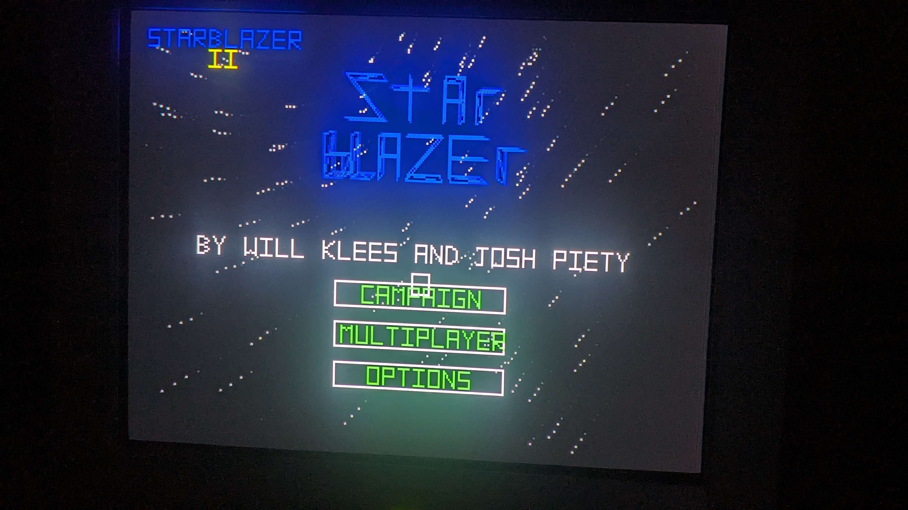
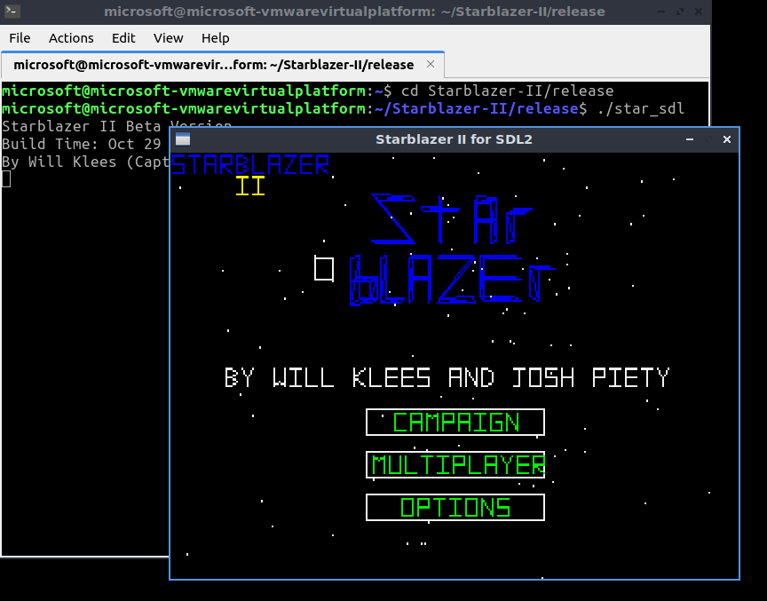
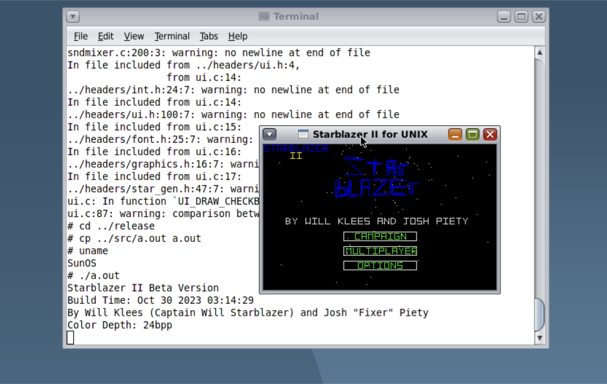

# Starblazer-II
By Will Klees & Josh Piety

To-do List
- make the game

**Win32 Version**  
Supported Operating Systems: Windows 95 or higher, Windows NT 3.50 or higher (x86, MIPS, PowerPC, Alpha, AXP64, IA-64), ReactOS, Wine  
Supported Compilers: Visual C++ 2.0 or higher, MinGW  
Build Instructions: Run make.bat 
 

**MS-DOS (VGA) Version**  
Supported Compilers: Open Watcom  
Build Instructions: Run src/dosmake.bat


**Linux (SDL2) Version**  
Supported Compilers: GCC  
Build Instructions: make -f Makefile.sdl
  

**UNIX (X Windows) Version**  
Supported Operating Systems: Any POSIX-compliant UNIX with an X Server  
Supported Compilers: GCC  
Build Instructions: make -f Makefile.nix


**StarblazerGeneric Info**  
To make a barebones port of Starblazer II to a new platform, only a few platform-specific functions are needed to be implemented. Take one of the existing build scripts and replace the platform file (e.g. ``star_win.c``) with your own. The DOS port is an excellent simple version to study.
- ``void SG_Init(int argc, char** argv)``: Performs any platform-specific initialization (i.e. creating a window) and calls ``SG_GameInit()`` to initialize some game state
- ``bool_t SG_KeyDown(char key)``: Returns whether a given key is currently being held down or not
- ``void SG_ReadMouse(SG_mouse_t* mouse)``: Returns the mouse position between (0,0) and (319,199) in ``mouse->x`` and ``mouse->y`` and the state of the left mouse button in ``mouse->buttons[0]``
- ``void SG_DrawFrame()``: Blits the 8bpp palletized bitmap pointed to by ``frontbuffer`` to the screen
- ``void SG_SetPaletteIndex(uint8 index, uint8 r, uint8 g, uint8 b)``: Sets the given index in the palette of the display device to the specified color
- ``void SG_ProcessEvents()``: Does any event processing (i.e. updating event queues, etc.) necessary for the system
- ``void SG_Sleep(int ms)``: Halt execution for a specified number of miliseconds (and in a multitasking environment, yield CPU control to the scheduler for that time)
- ``uint32 SG_GetTicks()``: Return the current time with milisecond precision

Here's an example ``main`` function:
```c
int main(){
  SG_WelcomeMessage(); //display the welcome message
  SG_Init(0, 0); //initialize the game
  SG_InitPalette(); //initialize the palette
  title_init(); //prepare to go to the title screen

  while(1){SG_Tick();} //tick the game
}
```

Networking, sound, and joystick support are optional features.
