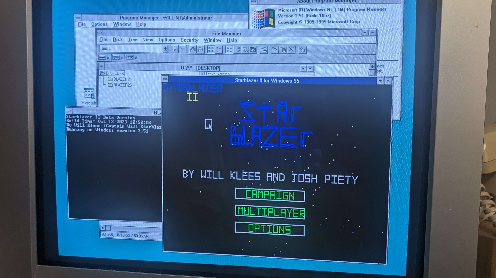

# Starblazer-II
By Will Klees & Josh Piety

To-do List
- make the game

**Win32 Version**  
Supported Operating Systems: Windows 95 or higher, Windows NT 3.50 or higher (x86, MIPS, PowerPC, Alpha, AXP64, IA-64), ReactOS, Wine  
Supported Compilers: Visual C++ 2.0 or higher, MinGW  
Build Instructions: Run make.bat 
 

**MS-DOS (VGA) Version**  
Supported Compilers: Open Watcom  
Build Instructions: Run src/dosmake.bat

**Linux (SDL2) Version**  
Supported Compilers: GCC  
Build Instructions: make -f Makefile.sdl
  

**UNIX (X Windows) Version**  
Supported Operating Systems: Any POSIX-compliant UNIX with an X Server  
Supported Compilers: GCC  
Build Instructions: make -f Makefile.nix

**StarblazerGeneric Info**
